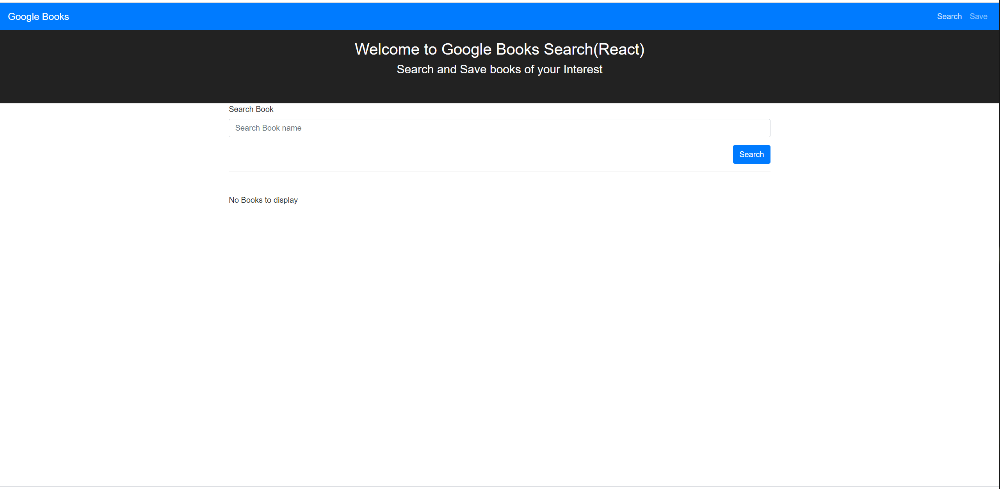
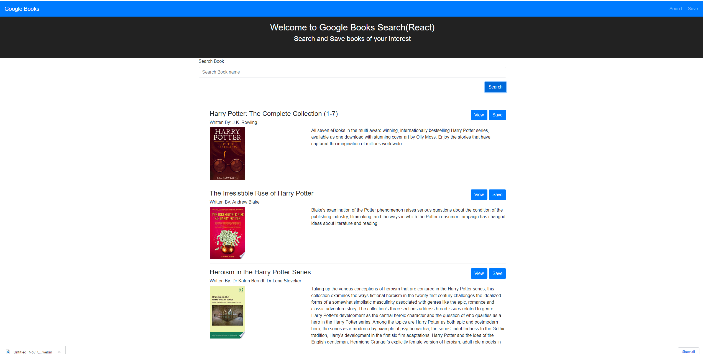
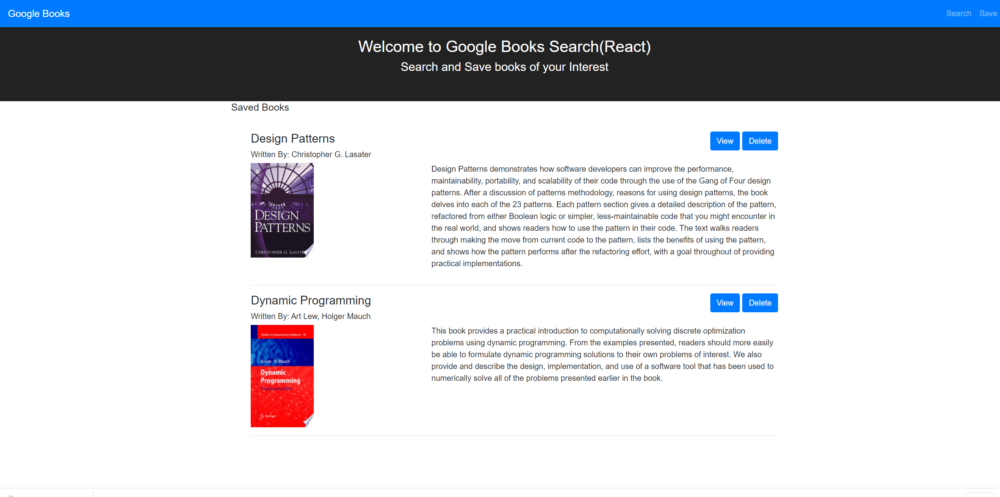

# google-book-search


## The Repository

The link to the website repository: [Website Repo link](https://github.com/NavdeepDP/google-book-search)

The link to deployed website [Website Link](https://tranquil-scrubland-79336.herokuapp.com/)

## Development Environment
- Code is developed in VS code Studio using React, MongoDB, Nodejs and Express

## Website Functionality
 - User can search for books via the Google Books API and render them here. User has the option to "View" a book, bringing them to the book on Google Books, or "Save" a book, saving it to the Mongo database.

-  Renders all books saved to the Mongo database. User has an option to "View" the book, bringing them to the book on Google Books, or "Delete" a book, removing it from the Mongo database.

### Demo 


### Home page


### Search Books



### Saved Books




## React Express APP: Starting the app locally

Start by installing front and backend dependencies. While in this directory, run the following command:

```
npm install
```

This should install node modules within the server and the client folder.

After both installations complete, run the following command in your terminal:

```
npm start
```

Your app should now be running on <http://localhost:3000>. The Express server should intercept any AJAX requests from the client.


## References

- Google Books API
- React Documentation
